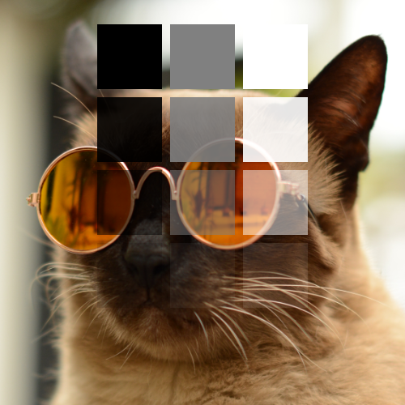
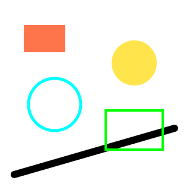
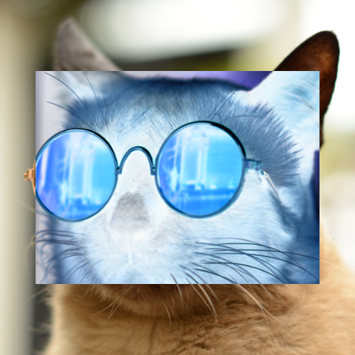
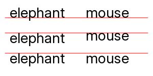
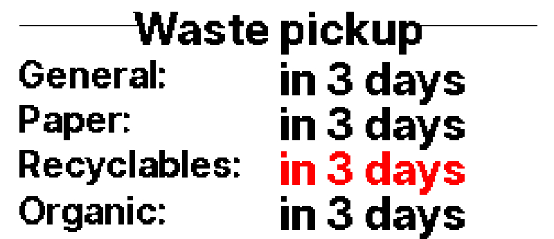
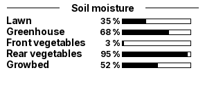

# imglib

## Description

This is a TypeScript image library.

Features include:
- [Drawing primitives](#drawing)
- [Overlays](#compositing)
- [Text rendering](#text-rendering)
- [Resizing and cropping](#croppingresizing)

## Motivation

The heavy lifting is done by `sharp`, a powerful and very fast image
manipulation library, but it adds significant convenience features to the API:

- In sharp operations are executed in an order determined by the operation types,
  in imglib operations are executed in the order you specify them, for example
  crop-then-resize vs resize-then-crop.
- Sharp is picky about inputs, for example it won't composite an image on top of
  another if the overlay extends beyond the base image.
- Drawing primitives require hand-written SVG in sharp.
- Sharp can style text using Pango markup, imglib offers some helpers for that.
- Transparency and masking in sharp is hard to understand.

## Usage

Create an `Image` object, then apply operations, end with an output operation:

```typescript
let image_data = Image
    .file({ path: imageFile("photo.png") })
    .resize({ width: 200, height: 50, mode: "cover", })
    .drawRect({ x: 10, y: 10, width: 80, height: 30, stroke: "red", strokeWidth: 4, })
    .toBuffer({ format: "png" })
```

## Development

Read AGENTS.md, it's hand-written and very suitable for human agents as well.

AI workflow: I typically write a test by hand, let an agent do the
implementation, skim the implementation and commit. All text/documentation is
written by me, I can't put up with AI-written prose.

## Some usage examples

#### Color threshold:

 → 

#### Midtones ("gamma") adjustment:

 → 

#### Compositing



#### Drawing



#### Masked compositing:




#### Cropping/resizing


#### Text rendering






